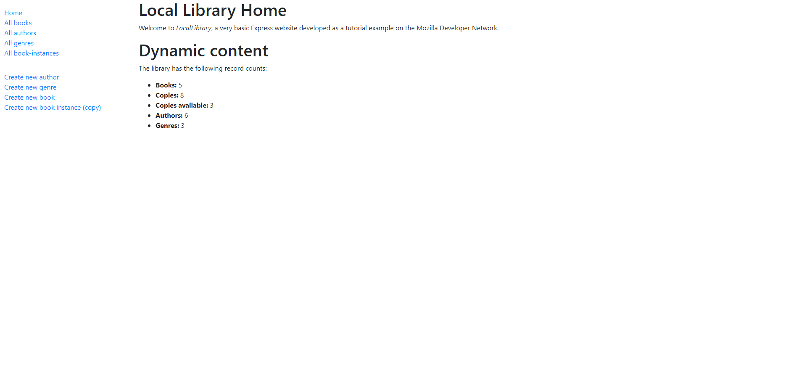
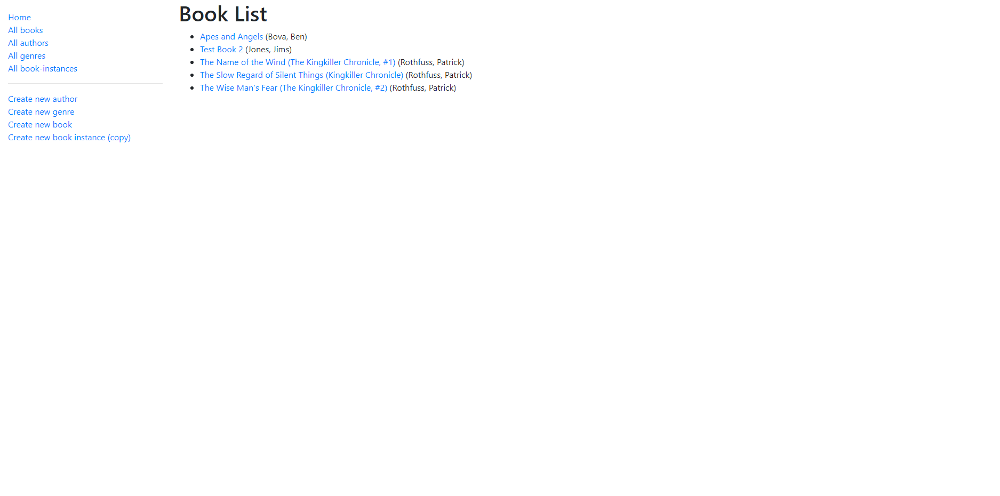
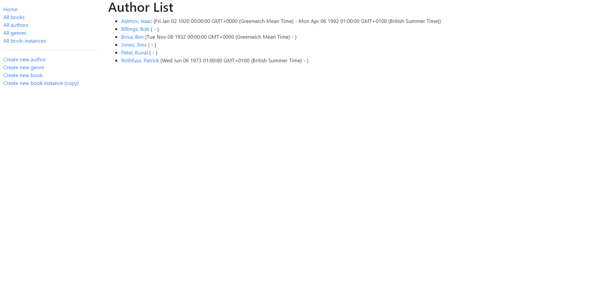
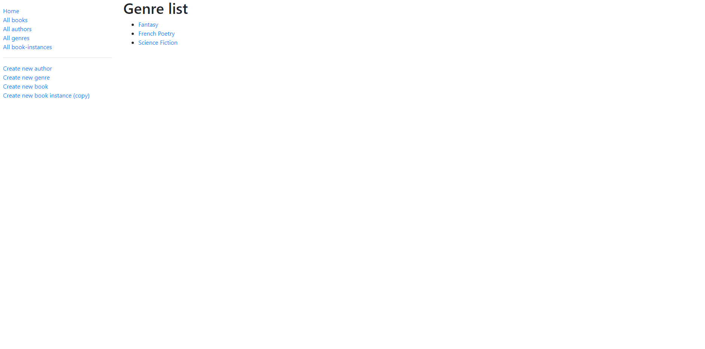
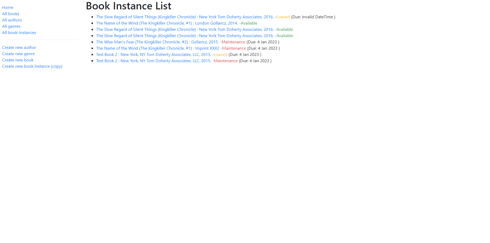
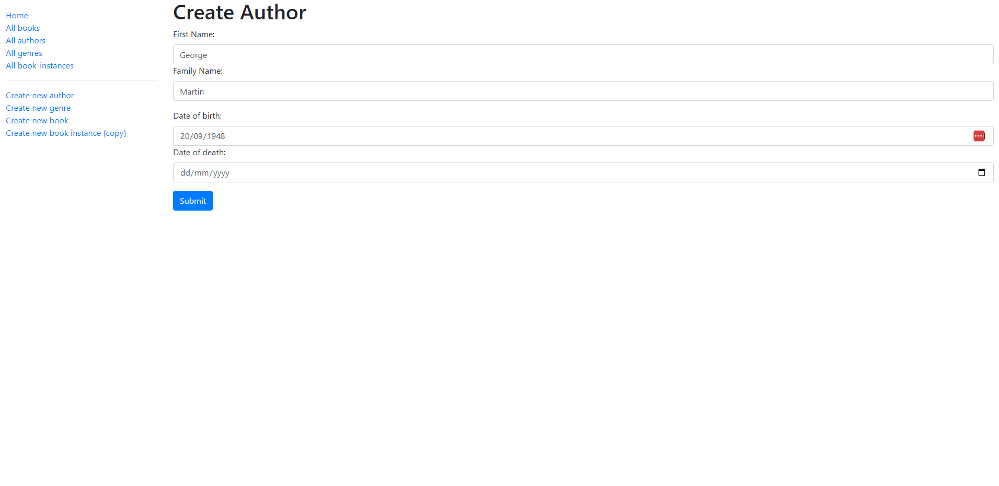
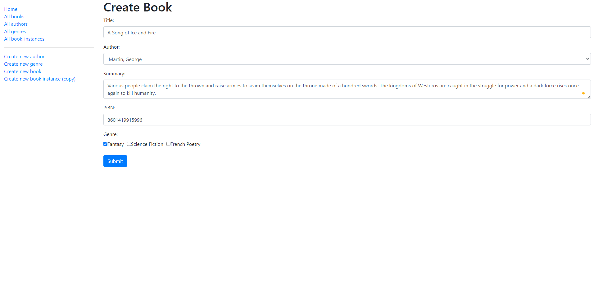

# Local Library

Following MDN's Express tutorial I created a Local Library website. The user can:
- Add books to the database
- Add authors to the database
- Add genres to the database
- Add book instances (e.g. ISBN number, status of book, when it is due back etc.)
- Update all of the above
- Delete all of the above

This is my first project created using Express with MongoDB. 

This is the tutorial I followed: https://developer.mozilla.org/en-US/docs/Learn/Server-side/Express_Nodejs/Tutorial_local_library_website

## Tech Stack
- Node/Express
- MongoDB
- Pug 

## Screenshots
### Home page

---

### All Books page

---

### All Authors page

---

### All Genres page

---

### All Book Instances page

---

### Create Author page

---

### Create Book page

---
